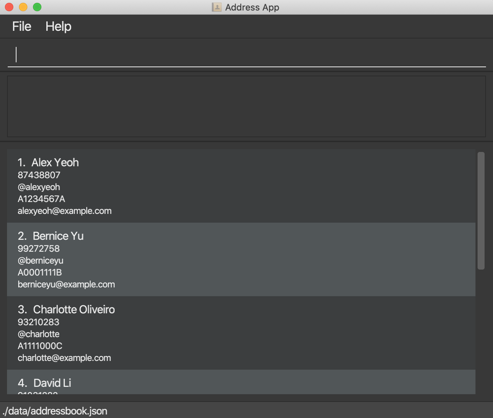

# TAsker

## About

TAsker is a desktop application that seeks to help NUS CS TAs better manage their classes. Optimized for use via a
Command Line Interface (CLI), users may track student’s submissions, consultation timings and grades, through the
Graphical User Interface (GUI) in a structured manner.

If you are interested in using TAsker, head over to the Quick Start section of the **[User Guide](https://github.com/AY2021S1-CS2103T-F11-1/tp/blob/master/docs/UserGuide.md)** to find out more.

## User Interface

## Acknowledgements

This project is based on the AddressBook-Level3 project created by the [SE-EDU initiative](https://se-education.org).
