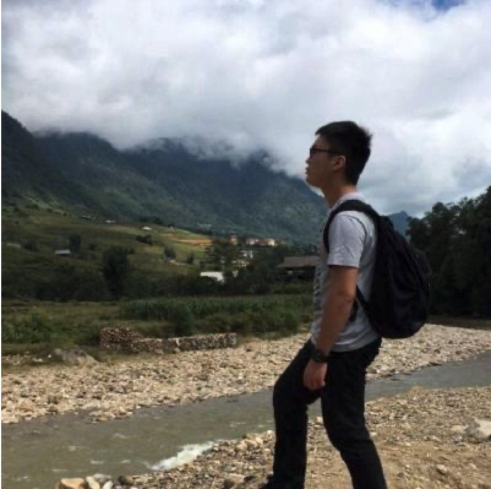
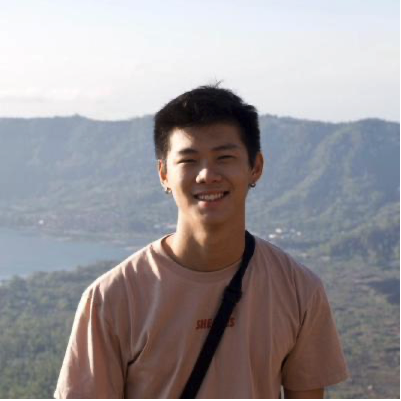
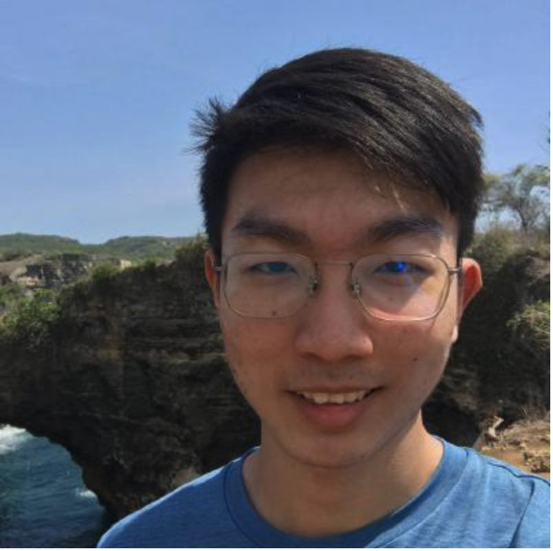
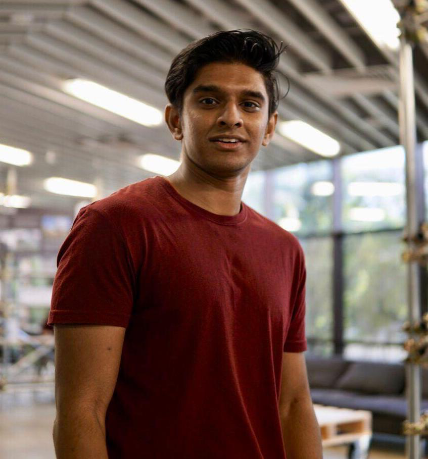

We are a team based in the [School of Computing, National University of Singapore](http://www.comp.nus.edu.sg).
This is a team project written using purely Java, created for CS2103T.
You can reach us at the email `seer[at]comp.nus.edu.sg`

## Project team

### Professor Damith C

[[homepage](http://www.comp.nus.edu.sg/~damithch)]
[[github](https://github.com/damithc)]

- Role: Project Advisor

### Christopher Goh

[[github](http://github.com/chrisgzf)]
[[portfolio](team/chrisgzf.md)]

- Role: Team Lead
- Responsibilities: UI/UX

### Noel Kwan

[[github](http://github.com/kwannoel)] 
[[portfolio](team/kwannoel.md)]

- Role: Developer
- Responsibilities: Data

### Sun Yitao

[[github](http://github.com/sun-yitao)]
[[portfolio](team/sun-yitao.md)]

- Role: Developer
- Responsibilities: Dev Ops + Threading

### Rachel Ng

[[github](http://github.com/rnmy)]
[[portfolio](team/rnmy.md)]

- Role: Developer
- Responsibilities: Testing

### Rishi Ravikumar

[[github](http://github.com/rishi5154)]
[[portfolio](team/rishi5154.md)]

- Role: Developer
- Responsibilities: UI/UX
