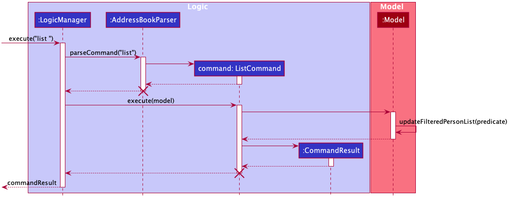
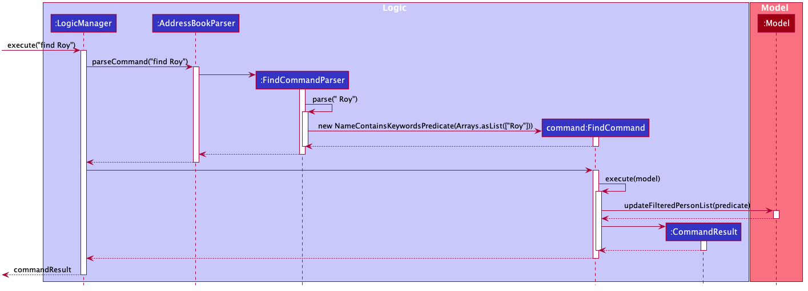

- Table of Contents
  {:toc}

---

## **Setting up, getting started**

Refer to the guide [_Setting up and getting started_](SettingUp.md).

---

## **Design**

### Architecture


The **_Architecture Diagram_** given above explains the high-level design of the App. Given below is a quick overview of each component.

<div markdown="span" class="alert alert-primary">

:bulb: **Tip:** The `.puml` files used to create diagrams in this document can be found in the [diagrams](https://github.com/AY2021S1-CS2103T-F11-1/tp/tree/master/docs/diagrams/) folder. Refer to the [_PlantUML Tutorial_ at se-edu/guides](https://se-education.org/guides/tutorials/plantUml.html) to learn how to create and edit diagrams.

</div>

**`Main`** has two classes called [`Main`](https://github.com/AY2021S1-CS2103T-F11-1/tp/tree/master/src/main/java/seedu/address/Main.java) and [`MainApp`](https://github.com/AY2021S1-CS2103T-F11-1/tp/tree/master/src/main/java/seedu/address/MainApp.java). It is responsible for,

- At app launch: Initializes the components in the correct sequence, and connects them up with each other.
- At shut down: Shuts down the components and invokes cleanup methods where necessary.

[**`Commons`**](#common-classes) represents a collection of classes used by multiple other components.

The rest of the App consists of four components.

- [**`UI`**](#ui-component): The UI of the App.
- [**`Logic`**](#logic-component): The command executor.
- [**`Model`**](#model-component): Holds the data of the App in memory.
- [**`Storage`**](#storage-component): Reads data from, and writes data to, the hard disk.

Each of the four components,

- defines its _API_ in an `interface` with the same name as the Component.
- exposes its functionality using a concrete `{Component Name}Manager` class (which implements the corresponding API `interface` mentioned in the previous point.

For example, the `Logic` component (see the class diagram given below) defines its API in the `Logic.java` interface and exposes its functionality using the `LogicManager.java` class which implements the `Logic` interface.


**How the architecture components interact with each other**

The _Sequence Diagram_ below shows how the components interact with each other for the scenario where the user issues the command `delete 1`.


The sections below give more details of each component.

### UI component


**API** :
[`Ui.java`](https://github.com/AY2021S1-CS2103T-F11-1/tp/tree/master/src/main/java/seedu/address/ui/Ui.java)

The UI consists of a `MainWindow` that is made up of parts e.g.`CommandBox`, `ResultDisplay`, `PersonListPanel`, `StatusBarFooter` etc. All these, including the `MainWindow`, inherit from the abstract `UiPart` class.

The `UI` component uses JavaFx UI framework. The layout of these UI parts are defined in matching `.fxml` files that are in the `src/main/resources/view` folder. For example, the layout of the [`MainWindow`](https://github.com/AY2021S1-CS2103T-F11-1/tp/tree/master/src/main/java/seedu/address/ui/MainWindow.java) is specified in [`MainWindow.fxml`](https://github.com/AY2021S1-CS2103T-F11-1/tp/tree/master/src/main/resources/view/MainWindow.fxml)

The `UI` component,

- Executes user commands using the `Logic` component.
- Listens for changes to `Model` data so that the UI can be updated with the modified data.

### Logic component


**API** :
[`Logic.java`](https://github.com/AY2021S1-CS2103T-F11-1/tp/tree/master/src/main/java/seedu/address/logic/Logic.java)

1. `Logic` uses the `AddressBookParser` class to parse the user command.
1. This results in a `Command` object which is executed by the `LogicManager`.
1. The command execution can affect the `Model` (e.g. adding a person).
1. The result of the command execution is encapsulated as a `CommandResult` object which is passed back to the `Ui`.
1. In addition, the `CommandResult` object can also instruct the `Ui` to perform certain actions, such as displaying help to the user.

Given below is the Sequence Diagram for interactions within the `Logic` component for the `execute("delete 1")` API call.


<div markdown="span" class="alert alert-info">:information_source: **Note:** The lifeline for `DeleteCommandParser` should end at the destroy marker (X) but due to a limitation of PlantUML, the lifeline reaches the end of diagram.
</div>

### Model component


**API** : [`Model.java`](https://github.com/AY2021S1-CS2103T-F11-1/tp/tree/master/src/main/java/seedu/address/model/Model.java)

The `Model`,

- stores a `UserPref` object that represents the user’s preferences.
- stores the address book data.
- exposes an unmodifiable `ObservableList<Person>` that can be 'observed' e.g. the UI can be bound to this list so that the UI automatically updates when the data in the list change.
- does not depend on any of the other three components.

<div markdown="span" class="alert alert-info">:information_source: **Note:** An alternative (arguably, a more OOP) model is given below. It has a `Tag` list in the `Tasker`, which `Person` references. This allows `Tasker` to only require one `Tag` object per unique `Tag`, instead of each `Person` needing their own `Tag` object.<br>


</div>

### Storage component


**API** : [`Storage.java`](https://github.com/AY2021S1-CS2103T-F11-1/tp/tree/master/src/main/java/seedu/address/storage/Storage.java)

The `Storage` component,

- can save `UserPref` objects in json format and read it back.
- can save the address book data in json format and read it back.

### Common classes

Classes used by multiple components are in the `seedu.addressbook.commons` package.

---

## **Implementation**

This section describes some noteworthy details on how certain features are implemented.

### View all student data

Querying the data of all current students in TAsker is really simple. Once the `list` command is inputted, the name,
phone number, telegram tag, matric number, email, tutorial classes and attendance record of all students are displayed
on TAsker's GUI.

#### Sequence of action 

1. `LogicManager` processes the user input "list".
2. AddressBookParser is called with it's `parseCommand(userInput)` method to parse input, which returns a new
  `ListCommand` object
3. Our new `ListCommand` object calls its own `execute` method with the `model` field of `LogicManager` as input.
4. Within the `ListCommand#execute` method, the `model` field calls its own `updateFilteredPersonList` method to update
   the list to show all persons.
5. Lastly, a new `CommandResult` with the relevant success message is finally returned to `LogicManager`.   

All of these details and interactions are captured in the sequence diagram below.



### Find a student's data

Querying the data of a specific student in TAsker is just as simple as finding all. Once the `find <NAME>` command 
is inputted, the name,
phone number, telegram tag, matric number, email, tutorial classes and attendance record of the specific student 
is displayed on TAsker's GUI.

#### Sequence of action 

1. `LogicManager` processes the user input "find Roy", for example.
2. AddressBookParser is called with it's `parseCommand(userInput)` method to parse input, which in turns creates a 
 new `FindCommandParser` object
3. The `FindCommandParser` object calls its own `parse` method with the `" Roy"` as input.
4. Now, the `" Roy"` argument is broken down into its individual strings, with whitespace removed and into an array, 
   which is processed and used as predicate for filtering out the desired student.
5. Within the `ListCommand#execute` method, the `model` field calls its own `updateFilteredPersonList` method to update
   the list to show all persons.
6. Our new `ListCommand` object calls its own `execute` method with the `model` field of `LogicManager` as input.
7. Lastly, a new `CommandResult` with the relevant message is finally returned to `LogicManager`.   

All of these details and interactions are captured in the sequence diagram below.



### Create Student data

`TAsker` now supports creating student data as well. We extended `TAsker` with 2 relevant fields,
`MatricNumber` and `Telegram` which track their matriculation numbers and Telegram handles respectively.

##### Using regexes to validate our fields

To ensure the correct fields are included, 
we have introduced regexes for Matriculation numbers and telegram handles
 which perform the validation for us.
 
- Matriculation number validation regex
    ```
    ^A\\d{7}[A-Z]$
    ```
  `^` means to match from the start of the line.
  
  `A` means the first letter should be 'A'.
  
  `\\d{7}` means there should be 7 digits from 0 to 9. 
  Note that Java uses `\\d` rather than `\d` to escape the `\` character from the string.
  
  `[A-Z]` means that the last character should be one of A to Z.

- Telegram handle validation regex
    ```
    ^[a-zA-Z0-9_-]{5,32}$
    ```
  
   `^` means to match from the start of the line.
   
   `[a-zA-Z0-9_-]` means we accept alphanumeric characters, including capital letters. We also accept `-` and `-`.
   
   `[...]{5, 32}` means we expect the string to contain between 5 to 32 (inclusive) of the above characters.

Implementing this is rather straightforward since we can reference other fields (`address`, `name`, ...) we use. 

##### Builder pattern

Another notable aspect is the [`Builder` pattern](https://en.wikipedia.org/wiki/Builder_patternhttps://en.wikipedia.org/wiki/Builder_pattern) we use for tests.

Thanks to this abstraction, refactoring tests for `Person` was relatively straightforward.

To illustrate this, suppose we have a test using `Person` class.

```java
class Test {
  test() {
     // Person with valid name
     assertEq(parsePerson("James,james@abc.xyz"), new Person("James", "james@abc.xyz"));
     // Person with valid email
     assertEq(parsePerson("Zack,zack@abc.xyz"), new Person("Zack", "zack@abc.xyz"));
  }
}
```

Now we add the two fields, `MatricNumber` and `Telegram` to `Person` and we have to update our tests:
```java
class Test {
  test() {
     // Person with valid name
     assertEq(
         parsePerson("James,james@abc.xyz"),
         new Person("James", "james@abc.xyz", "A0001111B", "james_lee") // Update 1
     );
     // Person with valid email
     assertEq(
         parsePerson("Zack,zack@abc.xyz"),
         new Person("Zack", "zack@abc.xyz", "A0002222B", "zack_koh") // Update 2
     );
  }
}
```

Note that we had to update at 2 areas with mock `MatricNumber` and `Telegram` handle.
We are only concerned about valid name and email, so we shouldn't have to update these!

`PersonBuilder` introduces default values for fields we don't want to test.

With `PersonBuilder`:
```java
class Test {
  test() {
     // Person with valid name
     assertEq(
         parsePerson("James,james@abc.xyz"),
         new PersonBuilder.addName("James").addEmail("james@abc.xyz").build()
     );
     // Person with valid email
     assertEq(
         parsePerson("Zack,zack@abc.xyz"),
         new PersonBuilder.addName("Zack").addEmail("zack@abc.xyz").build()
     );
  }
}
```

After we add `MatricNumber` and `Telegram` fields in `Person` we can update `PersonBuilder` with these:

```java
class PersonBuilder {
    // ...

    PersonBuilder() {
        // ...
        matricNumber = DEFAULT_MATRIC_NUMBER;
        telegram = DEFAULT_TELEGRAM;
    }

    Person addMatricNumber(String matricNumber) { /* ... */ }
    Person addTelegram(String telegram) { /* ... */ }
}
```

All our existing tests using `PersonBuilder` will still work, and all we had to do was update definitions in `PersonBuilder`.

### \[Proposed\] Undo/redo feature

#### Proposed Implementation

The proposed undo/redo mechanism is facilitated by `VersionedAddressBook`. It extends `Tasker` with an undo/redo history, stored internally as an `addressBookStateList` and `currentStatePointer`. Additionally, it implements the following operations:

- `VersionedAddressBook#commit()` — Saves the current address book state in its history.
- `VersionedAddressBook#undo()` — Restores the previous address book state from its history.
- `VersionedAddressBook#redo()` — Restores a previously undone address book state from its history.

These operations are exposed in the `Model` interface as `Model#commitAddressBook()`, `Model#undoAddressBook()` and `Model#redoAddressBook()` respectively.

Given below is an example usage scenario and how the undo/redo mechanism behaves at each step.

Step 1. The user launches the application for the first time. The `VersionedAddressBook` will be initialized with the initial address book state, and the `currentStatePointer` pointing to that single address book state.


Step 2. The user executes `delete 5` command to delete the 5th person in the address book. The `delete` command calls `Model#commitAddressBook()`, causing the modified state of the address book after the `delete 5` command executes to be saved in the `addressBookStateList`, and the `currentStatePointer` is shifted to the newly inserted address book state.


Step 3. The user executes `add n/David …​` to add a new person. The `add` command also calls `Model#commitAddressBook()`, causing another modified address book state to be saved into the `addressBookStateList`.


<div markdown="span" class="alert alert-info">:information_source: **Note:** If a command fails its execution, it will not call `Model#commitAddressBook()`, so the address book state will not be saved into the `addressBookStateList`.

</div>

Step 4. The user now decides that adding the person was a mistake, and decides to undo that action by executing the `undo` command. The `undo` command will call `Model#undoAddressBook()`, which will shift the `currentStatePointer` once to the left, pointing it to the previous address book state, and restores the address book to that state.


<div markdown="span" class="alert alert-info">:information_source: **Note:** If the `currentStatePointer` is at index 0, pointing to the initial Tasker state, then there are no previous Tasker states to restore. The `undo` command uses `Model#canUndoAddressBook()` to check if this is the case. If so, it will return an error to the user rather
than attempting to perform the undo.

</div>

The following sequence diagram shows how the undo operation works:


<div markdown="span" class="alert alert-info">:information_source: **Note:** The lifeline for `UndoCommand` should end at the destroy marker (X) but due to a limitation of PlantUML, the lifeline reaches the end of diagram.

</div>

The `redo` command does the opposite — it calls `Model#redoAddressBook()`, which shifts the `currentStatePointer` once to the right, pointing to the previously undone state, and restores the address book to that state.

<div markdown="span" class="alert alert-info">:information_source: **Note:** If the `currentStatePointer` is at index `addressBookStateList.size() - 1`, pointing to the latest address book state, then there are no undone Tasker states to restore. The `redo` command uses `Model#canRedoAddressBook()` to check if this is the case. If so, it will return an error to the user rather than attempting to perform the redo.

</div>

Step 5. The user then decides to execute the command `list`. Commands that do not modify the address book, such as `list`, will usually not call `Model#commitAddressBook()`, `Model#undoAddressBook()` or `Model#redoAddressBook()`. Thus, the `addressBookStateList` remains unchanged.


Step 6. The user executes `clear`, which calls `Model#commitAddressBook()`. Since the `currentStatePointer` is not pointing at the end of the `addressBookStateList`, all address book states after the `currentStatePointer` will be purged. Reason: It no longer makes sense to redo the `add n/David …​` command. This is the behavior that most modern desktop applications follow.


The following activity diagram summarizes what happens when a user executes a new command:


#### Design consideration:

##### Aspect: How undo & redo executes

- **Alternative 1 (current choice):** Saves the entire address book.

  - Pros: Easy to implement.
  - Cons: May have performance issues in terms of memory usage.

- **Alternative 2:** Individual command knows how to undo/redo by
  itself.
  - Pros: Will use less memory (e.g. for `delete`, just save the person being deleted).
  - Cons: We must ensure that the implementation of each individual command are correct.

_{more aspects and alternatives to be added}_

### \[Proposed\] Data archiving

_{Explain here how the data archiving feature will be implemented}_

---

## **Documentation, logging, testing, configuration, dev-ops**

- [Documentation guide](Documentation.md)
- [Testing guide](Testing.md)
- [Logging guide](Logging.md)
- [Configuration guide](Configuration.md)
- [DevOps guide](DevOps.md)

---

## **Appendix: Requirements**

### Product scope

**Target user profile (user persona)**:


Name: Jane

Age: 19

Undergraduate NUS CS Student, and a part-time teaching assistant

- is a teaching assistant for CS modules
- is busy because she is a overachieving student with lots of modules
- needs to take attendance
- needs to keep track of student’s assignments and their submission status
- prefer desktop apps over other types
- can type fast
- codes a lot, so she prefers keyboard-based interfaces

**Value proposition**: TAs can track students' details and submissions in a efficient and structured manner

### User stories

Priorities: High (must have) - `* * *`, Medium (nice to have) - `* *`, Low (unlikely to have) - `*`

| Priority | As a …​  | I want to …​                                                            | So that I can…​                                                            |
| -------- | -------- | ----------------------------------------------------------------------- | -------------------------------------------------------------------------- |
| `* * *`  | user     | CRUD student details into my data                                       | add/remove my students data when they join/drop the module                 |
| `* * *`  | user     | CRUD my students’ attendance                                            |                                                                            |
| `* * *`  | user     | CRUD my students’ assignments & status                                  | keep track of my students’ assignment’s submission status                  |
| `* *`    | user     | CRUD my student’s consultation requests                                 | keep track of my students’ consultation requests                           |
| `* *`    | user     | view all my upcoming consultations for the week, in chronological order | keep track of when my consultations are supposed to happen                 |
| `* *`    | user     | mark when I end each of my consultations                                | keep track of the time elapsed of each consultation session                |
| `*`      | user     | generate a summary of my weekly consultation hours                      | keep track of the total amount of consultation time, for claiming purposes |
| `*`      | new user | see usage instructions                                                  | refer to instructions when I forget how to use the App                     |

_{More to be added}_

### Use cases

(For all use cases below, the **System** is `TAsker` and the **Actor** is the `user`, unless specified otherwise)

**Use case: List all students**

**MSS**

1.  User requests to list students
2.  TAsker shows a list of students

    Use case ends.

**Extensions**

- 2a. The list is empty.

  Use case ends.

**Use case: Add a student**

**MSS**

1.  User requests to list students
2.  TAsker shows a list of students
3.  User requests to add a specific student to the list
4.  TAsker adds the student to the list

    Use case ends.

**Extensions**

- 2a. The student's details are insufficient/cannot be parsed.

  - 2a1. TAsker shows an error message.

    Use case resumes at step 2.

**Use case: Delete a student**

**MSS**

1.  User requests to list students
2.  TAsker shows a list of students
3.  User requests to delete a specific student in the list
4.  TAsker deletes the student

    Use case ends.

**Extensions**

- 2a. The list is empty.

  Use case ends.

- 3a. The given index is invalid.

  - 3a1. TAsker shows an error message.

    Use case resumes at step 2.

**Use case: Update a student's details**

**MSS**

1.  User requests to list students
2.  TAsker shows a list of students
3.  User requests to update a specific student's details in the list
4.  TAsker updates the student's details

    Use case ends.

**Extensions**

- 2a. The given index is invalid.

  - 2a1. TAsker shows an error message.

    Use case resumes at step 2.

- 3a. The student's details are insufficient/cannot be parsed.

  - 3a1. TAsker shows an error message.

    Use case resumes at step 2.

**Use case: See all assignment statuses**

**MSS**

1.  User requests to list students
1.  TAsker shows a list of students, with their assignment statuses

    Use case ends.

**Extensions**

- 2a. No assignments are added.

  - 2a1. TAsker will just show the student's information

    Use case resumes at step 2.

**Use case: Add an assignment**

**MSS**

1.  User requests to add a assignment to the list
1.  TAsker adds the assignment to the list

    Use case ends.

**Use case: Delete an assignment**

**MSS**

1.  User requests to list students
1.  TAsker shows a list of students, with their assignment statuses
1.  User requests to delete an assignment from the list
1.  TAsker deletes the assignment from the list

    Use case ends.

**Extensions**

- 2a. The given assignment is invalid.

  - 2a1. TAsker shows an error message.

    Use case resumes at step 2.

**Use case: Update a student's assignment submission status**

**MSS**

1.  User requests to list students
2.  TAsker shows a list of students, along with their assignment statuses
3.  User requests to update a specific student's assignment submission status
4.  TAsker updates the specific student's assignment submission status

    Use case ends.

**Extensions**

- 2a. The given index is invalid.

  - 2a1. TAsker shows an error message.

    Use case resumes at step 2.

- 3a. The given assignment is invalid.

  - 3a1. TAsker shows an error message.

    Use case resumes at step 2.

- 4a. The given assignment status is invalid.

  - 4a1. TAsker shows an error message.

    Use case resumes at step 2.

_{More to be added}_

### Non-Functional Requirements

1.  Should be able to work offline, without any internet connection requirement.
1.  Should work on any _mainstream OS_ as long as it has Java `11` or above
    installed.
1.  Should be able to hold up to 1000 persons without a noticeable sluggishness
    in performance for typical usage.
1.  Should not be too bright or even have a dark mode, at night timings.
1.  A user with above average typing speed for regular English text (i.e. not code,
    not system admin commands) should be able to accomplish most of the tasks faster
    using commands than using the mouse.

_{More to be added}_

### Glossary

- **Mainstream OS**: Windows, Linux, Unix, macOS
- **Private contact detail**: A contact detail that is not meant to be shared with others
- **TA**: Teaching Assistant
- **CS**: Computer Science
- **CRUD**: Create, Read, Update, Delete

---

## **Appendix: Instructions for manual testing**

Given below are instructions to test the app manually.

<div markdown="span" class="alert alert-info">:information_source: **Note:** These instructions only provide a starting point for testers to work on;
testers are expected to do more *exploratory* testing.

</div>

### Launch and shutdown

1. Initial launch

   1. Download the jar file and copy into an empty folder

   1. Double-click the jar file Expected: Shows the GUI with a set of sample contacts. The window size may not be optimum.

1. Saving window preferences

   1. Resize the window to an optimum size. Move the window to a different location. Close the window.

   1. Re-launch the app by double-clicking the jar file.<br>
      Expected: The most recent window size and location is retained.

1. _{ more test cases …​ }_

### Deleting a person

1. Deleting a person while all persons are being shown

   1. Prerequisites: List all persons using the `list` command. Multiple persons in the list.

   1. Test case: `delete 1`<br>
      Expected: First contact is deleted from the list. Details of the deleted contact shown in the status message. Timestamp in the status bar is updated.

   1. Test case: `delete 0`<br>
      Expected: No person is deleted. Error details shown in the status message. Status bar remains the same.

   1. Other incorrect delete commands to try: `delete`, `delete x`, `...` (where x is larger than the list size)<br>
      Expected: Similar to previous.

1. _{ more test cases …​ }_

### Saving data

1. Dealing with missing/corrupted data files

   1. _{explain how to simulate a missing/corrupted file, and the expected behavior}_

1. _{ more test cases …​ }_
