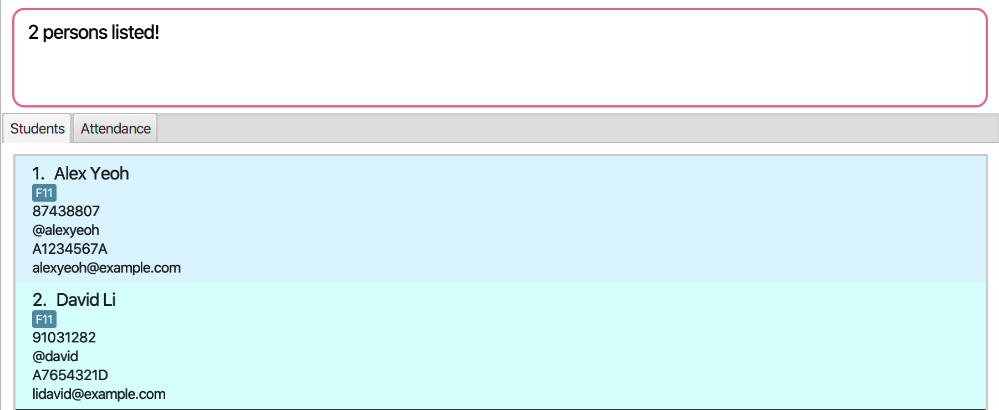

TAsker is a **desktop app for Teaching Assistants (TAs) to manage student administration, optimized for use via a Command Line Interface (CLI)**. It still has the benefits of a Graphical User Interface (GUI). If you can type fast, TAsker can get your administrative tasks done faster than traditional GUI apps.

### Table of Contents

- [Quick start](#quick-start)
- [Features](#features)
  - [Viewing help : `help`](#viewing-help--help)
  - [Adding a student: `add`](#adding-a-student-add)
  - [Listing all students : `list`](#listing-all-students--list)
  - [Editing a student : `edit`](#editing-a-student--edit)
  - [Locating students by name: `find`](#locating-students-by-name-find)
  - [Deleting a student : `delete`](#deleting-a-student--delete)
  - [Clearing all entries : `clear`](#clearing-all-entries--clear)
  - [Show Attendance [coming soon] : `showatt`](#show-attendance-coming-soon--showatt)
  - [Marking Attendance [coming soon] : `attend`](#marking-attendance-coming-soon--attend)
  - [Unmarking Attendance [coming soon] : `unattend`](#unmarking-attendance-coming-soon--unattend)
  - [Exiting the program : `exit`](#exiting-the-program--exit)
  - [Saving the data](#saving-the-data)
  - [Archiving data files [coming in v2.0] : `archive`](#archiving-data-files-coming-in-v20--archive)
- [FAQ](#faq)
- [Command summary](#command-summary)

---

## Quick start

1. Ensure you have Java `11` or above installed in your Computer.

1. Download the latest `TAsker.jar` from [here](https://github.com/AY2021S1-CS2103T-F11-1/tp/releases).

1. Copy the file to the folder you want to use as the _home folder_ for your TAsker.

1. Double-click the file to start the app. The GUI similar to the below should appear in a few seconds. Note how the app contains some sample data. 
   

1. Type the command in the command box and press Enter to execute it. e.g. typing **`help`** and pressing Enter will open the help window. 
   Some example commands you can try:

   - **`list`** : Lists all student.

   - **`add`**`n/John Doe p/98765432 e/johnd@example.com a/John street, block 123, #01-01` : Adds a student named `John Doe` to the Address Book.

   - **`delete`**`3` : Deletes the 3rd student shown in the current list.

   - **`clear`** : Deletes all students.

   - **`exit`** : Exits the app.

1. Refer to the [Features](#features) below for details of each command.

---

## Features

**:information_source: Notes about the command format:** 

- Words in `UPPER_CASE` are the parameters to be supplied by the user. 
  e.g. in `add n/NAME`, `NAME` is a parameter which can be used as `add n/John Doe`.

- Items in square brackets are optional. 
  e.g `n/NAME [t/TAG]` can be used as `n/John Doe t/friend` or as `n/John Doe`.

- Items with `…`​ after them can be used multiple times including zero times. 
  e.g. `[t/TAG]…​` can be used as ` ` (i.e. 0 times), `t/friend`, `t/friend t/family` etc.

- Parameters can be in any order. 
  e.g. if the command specifies `n/NAME p/PHONE_NUMBER`, `p/PHONE_NUMBER n/NAME` is also acceptable.

### Viewing help : `help`

Shows a message explaining how to access the help page.

Format: `help`

### Adding a student: `add`

Adds a student to the address book.

Format: `add n/NAME p/PHONE_NUMBER e/EMAIL a/ADDRESS [t/TAG]…​`

:bulb: **Tip:**
A student can have any number of tags (including 0)

Examples:

- `add n/John Doe p/98765432 e/johnd@example.com a/John street, block 123, #01-01`
- `add n/Betsy Crowe t/friend e/betsycrowe@example.com a/Newgate Prison p/1234567 t/criminal`

### Listing all students : `list`

Shows a list of all students in charge by the TA.

Format: `list`

### Editing a student : `edit`

Edits an existing student's information.

Format: `edit INDEX [n/NAME] [p/PHONE] [e/EMAIL] [t/TAG]…​`

- Edits the student at the specified `INDEX`. The index refers to the index number shown in the displayed student list. The index **must be a positive integer** 1, 2, 3, …​
- At least one of the optional fields must be provided.
- Existing values will be updated to the input values.
- When editing tags, the existing tags of the student will be removed i.e adding of tags is not cumulative.
- You can remove all the student’s tags by typing `t/` without
  specifying any tags after it.

Examples:

- `edit 1 p/91234567 e/johndoe@example.com` Edits the phone number and email address of the 1st student to be `91234567` and `johndoe@example.com` respectively.
- `edit 2 n/Betsy Crower t/` Edits the name of the 2nd students to be `Betsy Crower` and clears all existing tags.

### Locating students by name: `find`

Finds students whose names contain any of the given keywords.

Format: `find KEYWORD [MORE_KEYWORDS]`

- The search is case-insensitive. e.g `hans` will match `Hans`
- The order of the keywords does not matter. e.g. `Hans Bo` will match `Bo Hans`
- Only the name is searched.
- Only full words will be matched e.g. `Han` will not match `Hans`
- Students matching at least one keyword will be returned (i.e. `OR` search).
  e.g. `Hans Bo` will return `Hans Gruber`, `Bo Yang`

Examples:

- `find John` returns `john` and `John Doe`
- `find alex david` returns `Alex Yeoh`, `David Li` 
  

### Deleting a student : `delete`

Deletes the specified student from the address book.

Format: `delete INDEX`

- Deletes the student at the specified `INDEX`.
- The index refers to the index number shown in the displayed student list.
- The index **must be a positive integer** 1, 2, 3, …​

Examples:

- `list` followed by `delete 2` deletes the 2nd student in the address book.
- `find Betsy` followed by `delete 1` deletes the 1st student in the results of the `find` command.

### Clearing all entries : `clear`

Clears all entries from the list of students.

Format: `clear`

### Show Attendance [coming soon] : `showatt`

Shows the attendance for tutorial on all dates / a specified date.

Format: `showatt [INDEX] [d/DATE]`

### Marking Attendance [coming soon] : `attend`

Marks the student as present for tutorial on a specified date.

Format: `attend [INDEX] d/DATE`

### Unmarking Attendance [coming soon] : `unattend`

Marks the student as absent (default) for tutorial on a specified date.

Format: `unattend INDEX d/DATE`

### Exiting the program : `exit`

Exits the program.

Format: `exit`

### Saving the data

TAsker data are saved in the hard disk automatically after any command that changes the data. There is no need to save manually.

### Archiving data files [coming in v2.0] : `archive`

Creates a copy of all current data, tagged with the current date and time.

e.g. running this command will create a file called `tasker_20200913_1041` containing all your saved data, in your `/data` folder.

Format: `archive`

---

## FAQ

**Q**: How do I start using TAsker?
 
**A**: Refer to our [Quick Start Guide](https://hackmd.io/@chrisgzf/TAskerUG#Quick-start) here.
 

**Q**: How do I transfer my data to another Computer? 
**A**: Install the app in the other computer and overwrite the empty data file it creates with the file that contains the data of your previous TAsker home folder.
 

**Q**: Can I import existing spreadsheets of my students?
 
**A**: This is not supported at the moment.
 

**Q**: How many students can I store?
 
**A**: More than you will ever teach in a lifetime.
 

**Q**: How do I submit a bug report?
 
**A**: [Open an issue on our github repository](https://github.com/AY2021S1-CS2103T-F11-1/tp/issues).
 

---

## Command summary

| Action                   | Format, Examples                                                                                                                                                      |
| ------------------------ | --------------------------------------------------------------------------------------------------------------------------------------------------------------------- |
| **Add**                  | `add n/NAME p/PHONE_NUMBER e/EMAIL a/ADDRESS [t/TAG]…​`   e.g., `add n/James Ho p/22224444 e/jamesho@example.com a/123, Clementi Rd, 1234665 t/friend t/colleague` |
| **Clear**                | `clear`                                                                                                                                                               |
| **Delete**               | `delete INDEX`  e.g., `delete 3`                                                                                                                                   |
| **Edit**                 | `edit INDEX [n/NAME] [p/PHONE_NUMBER] [e/EMAIL] [a/ADDRESS] [t/TAG]…​`  e.g.,`edit 2 n/James Lee e/jameslee@example.com`                                           |
| **Find**                 | `find KEYWORD [MORE_KEYWORDS]`  e.g., `find James Jake`                                                                                                            |
| **Show Attendance**      | `showatt [INDEX] [d/DATE]`                                                                                                                                            |
| **Marking Attendance**   | `attend [INDEX] d/DATE`                                                                                                                                               |
| **Unmarking Attendance** | `unattend INDEX d/DATE`                                                                                                                                               |
| **Archive**              | `archive`                                                                                                                                                             |
| **List**                 | `list`                                                                                                                                                                |
| **Help**                 | `help`                                                                                                                                                                |
| **Exit**                 | `exit`                                                                                                                                                                |
